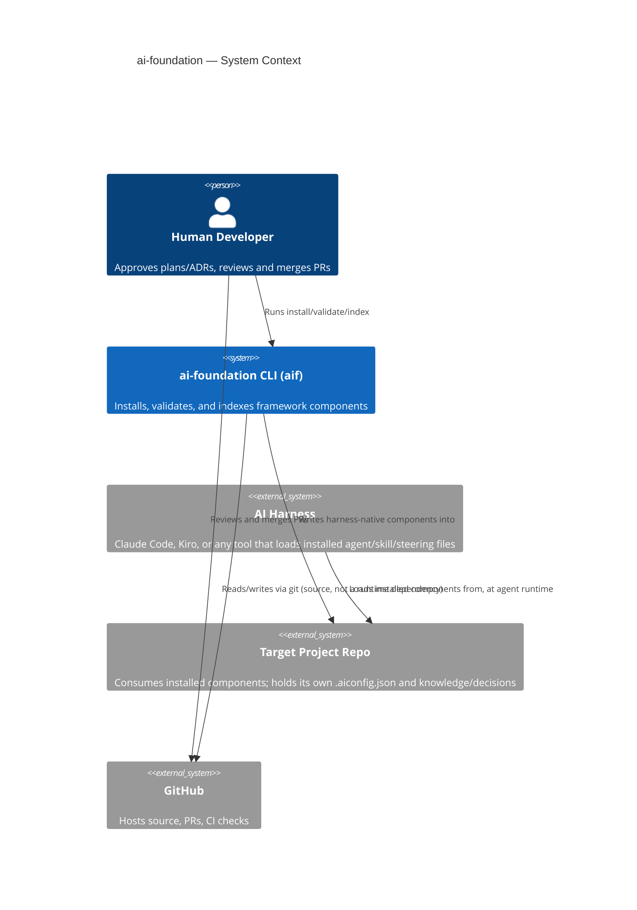

> Who and what ai-foundation talks to, at the C4 System Context (L1) level.

## Context diagram

## Business context

Domain-level communication partners and what they exchange, independent of protocol:

| Partner | Domain-level exchange |
|---|---|
| Human developer / project adopter | Chooses a bundle and approves Feature Plans/ADRs; receives an installed rule set (agents, skills, steering, standards) tailored to that choice. |
| AI harness | Receives the installed, harness-native component set and runs agents against it — a domain-level "consumer of the compiled output," not yet a specific protocol. |
| Target project repo | Supplies its own `.aiconfig.json` (bundle choice, paths, standards tags); receives the components `aif install` writes. |
| GitHub | A development-time partner for this repo's own source/PRs — not a runtime partner of the CLI. |

## Technical context

The actual channels and protocols behind the exchanges above:

| Channel | Detail |
|---|---|
| Local filesystem | `aif install`/`uninstall`/`validate`/`index`/`snapshot` read and write the local filesystem only — no network (§2 Constraints). |
| git / HTTPS | Source control and PRs, via whatever git client (or `ai-git`) a human or agent invokes directly — not a dependency the CLI opens itself. |
| MCP over stdio | Locally-implemented servers (`servers/dag`, `servers/gmail`) speak MCP over stdio, spawned by the harness's own MCP host at agent runtime. |
| MCP over HTTP (vendor-hosted) | `servers/youtrack` is a declarative pointer to JetBrains' own hosted MCP endpoint (`hosted: vendor` in its YAML) — no local process; bearer-token auth over HTTPS. |
| Per-server credentials | Gmail uses OAuth2 (`servers/gmail/auth.js`); YouTrack a static bearer token from `${YOUTRACK_TOKEN}`. Two patterns, no unifying mechanism yet — flagged as an undocumented decision in `docs/process-model.md`'s New ADRs list. |

## Out of scope here

Internal decomposition (agents/skills/steering/lib) is §5 Building Blocks, not
context — this section only covers ai-foundation's boundary with the outside world.
