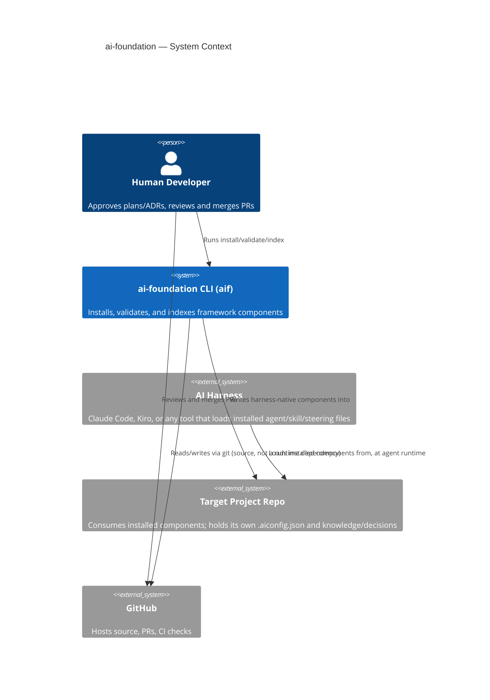

> Who and what ai-foundation talks to, at the C4 System Context (L1) level.

## Context diagram

## External actors

| Actor | Interaction |
|---|---|
| Human developer | Runs `aif` commands directly; approves Feature Plans and ADRs; reviews and merges every PR — no agent merges to `main` (`steering/engineering/git-workflow-projects.md`). |
| AI harness (Claude Code, Kiro) | Loads the harness-native form of installed agents/skills/steering that `aif install` produced; not a build-time dependency of `aif` itself. |
| Target project repo | The repo `aif install` targets. Owns its own `.aiconfig.json`, `knowledge/`, and `plans/` — ai-foundation writes into it but does not run inside it as a service. |
| GitHub | Where this repo's own source, PRs, and CI live. Not a runtime dependency of the CLI (see §2 Constraints — no network at install time). |

## Out of scope here

Internal decomposition (agents/skills/steering/lib) is §5 Building Blocks, not
context — this section only covers ai-foundation's boundary with the outside world.
