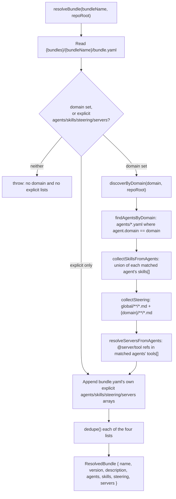

> How `resolveBundle()` turns a `bundle.yaml` into the concrete set of
> agents/skills/steering/servers that get installed.

## Why this needs its own section

`resolver.js` is 353 lines implementing a multi-step algorithm with real
branching (domain auto-discovery vs. explicit lists vs. both), not a thin
pass-through like most of §5's other blocks — worth opening up on its own.

## Resolution flow

## Steps in detail

1. **Load** — read `{paths per SOURCE_DIRS.bundles}/{bundleName}/bundle.yaml`; throw if
   missing, empty, or invalid YAML.
2. **Validate shape** — a bundle must set `domain`, at least one non-empty explicit
   list, or both. Neither is a hard error (a bundle that resolves to nothing is
   almost certainly a mistake, not an intentional empty install).
3. **Domain auto-discovery** (only if `domain` is set), in this fixed order:
   - `findAgentsByDomain` — every `agents/*.yaml` (excluding `_template.yaml`) whose
     own `domain` field matches.
   - `collectSkillsFromAgents` — union of `skill/*` entries across those agents'
     `skills` fields, de-prefixed via `parseSkillRef`.
   - `collectSteering` — `steering/global/**/*.md` plus `steering/{domain}/**/*.md`.
   - `resolveServersFromAgents` — any `@server/tool`-format tool reference in a
     matched agent's `tools` list, parsed via `parseServerToolRef`.
4. **Append explicit lists** — whatever `bundle.yaml` itself lists under
   `agents`/`skills`/`steering`/`servers` is concatenated onto whatever step 3
   discovered (both, not either/or, when a bundle sets both `domain` and explicit
   entries).
5. **Dedupe** — each of the four resulting lists is passed through `dedupe()`
   independently before being returned as the `ResolvedBundle`.

## Interface

| Export | Purpose |
|---|---|
| `resolveBundle(bundleName, repoRoot)` | The entry point above — returns a `ResolvedBundle`. |
| `parseSkillRef(ref)` | `"skill/decision-record"` → `"decision-record"`; bare names pass through; empty string → `null`. |
| `parseServerToolRef(tool)` | Parses an agent's `@server/tool`-format tool entry into its server name. |
| `listStandards/Bundles/Servers/HookResources(repoRoot)` | Directory listings used by `aif list` — independent of bundle resolution itself. |
| `dedupe(arr)` | Order-preserving de-duplication, shared by all four resolved lists. |

## Consumers

`lib/commands/install.js` is the only caller of `resolveBundle()` itself; `list.js`
uses the standalone `list*` helpers. Neither harness adapter (`claude.js`/`kiro.js`)
calls into `resolver.js` directly — they receive an already-resolved component list
from `install.js` and only handle the transform/write step (§5.02).
