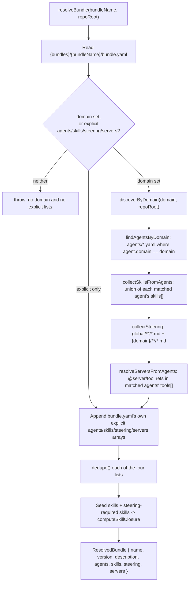

> How `resolveBundle()` turns a `bundle.yaml` into the concrete set of
> agents/skills/steering/servers that get installed.

## Overview Diagram

```mermaid
flowchart TD
  Start["resolveBundle(bundleName, repoRoot)"] --> Read["Read {bundles}/{bundleName}/bundle.yaml"]
  Read --> Check{"domain set,\nor explicit\nagents/skills/steering/servers?"}
  Check -->|neither| Error["throw: no domain and no explicit lists"]
  Check -->|domain set| Discover["discoverByDomain(domain, repoRoot)"]
  Check -->|explicit only| Explicit
  Discover --> D1["findAgentsByDomain: agents/*.yaml where agent.domain == domain"]
  D1 --> D2["collectSkillsFromAgents: union of each matched agent's skills[]"]
  D2 --> D3["collectSteering: global/**/*.md + {domain}/**/*.md"]
  D3 --> D4["resolveServersFromAgents: @server/tool refs in matched agents' tools[]"]
  D4 --> Explicit["Append bundle.yaml's own explicit agents/skills/steering/servers arrays"]
  Explicit --> Dedupe["dedupe() each of the four lists"]
  Dedupe --> Closure["Seed skills + steering-required skills -> computeSkillClosure"]
  Closure --> Out["ResolvedBundle { name, version, description, agents, skills, steering, servers }"]
```

## Motivation

Each domain-discovery sub-step below is a single read against one source
directory (`agents/`, `steering/`, `servers/`), triggered by one specific
condition. Keeping them as separate functions — rather than one function doing
all four reads — is what makes each independently testable and lets
`resolveBundle` itself stay a thin, linear pipeline: load → validate → discover
→ append → dedupe → expand skills (the skills of steering files too).

## Contained Building Blocks

### Pipeline stages

1. **Load** — read `{paths per SOURCE_DIRS.bundles}/{bundleName}/bundle.yaml`; throw if
   missing, empty, or invalid YAML.
2. **Validate shape** — a bundle must set `domain`, at least one non-empty explicit
   list, or both. Neither is a hard error (a bundle that resolves to nothing is
   almost certainly a mistake, not an intentional empty install).
3. **Domain auto-discovery** (only if `domain` is set) — see the internal building
   blocks below.
4. **Append explicit lists** — whatever `bundle.yaml` itself lists under
   `agents`/`skills`/`steering`/`servers` is concatenated onto whatever step 3
   discovered (both, not either/or, when a bundle sets both `domain` and explicit
   entries).
5. **Dedupe** — each of the four resulting lists is passed through `dedupe()`
   independently.
6. **Skill closure** — the deduped `skills` list, followed by every skill named in the
   `requires_skills` frontmatter of the resolved steering files, seeds
   `computeSkillClosure`. Its result (each seed followed by its transitive
   dependencies, in visit order) replaces `skills` in the returned `ResolvedBundle`.
   The closure only adds skills; it never alters an agent's own `skills`/`preload_skills`.

### Skill closure — building blocks

Exported (for tests and later callers) but not part of the bundle-listing surface.

| Function                     | Kind | Responsibility                                                                                                                                                                                                |
| ---------------------------- | ---- | ------------------------------------------------------------------------------------------------------------------------------------------------------------------------------------------------------------- |
| `parseRequiresSkills`        | Pure | Reads `requires_skills` from a markdown file's frontmatter. Entries are bare kebab-case names (a `skill/` prefix is normalised via `parseSkillRef`); non-list, non-string, or path-like entries throw.        |
| `computeSkillClosure`        | Pure | Depth-first transitive closure over an injected `getDeps(name)`. A visited set dedupes and stops at repeats, so cycles are legal and silent. A skill whose `getDeps` is `undefined` throws, naming the chain. |
| `createSkillDepsReader`      | I/O  | Returns a cached `getDeps` that reads `skills/{name}/SKILL.md` frontmatter; `undefined` when the file is absent. Rejects non-kebab-case names before building a path.                                         |
| `readSteeringRequiredSkills` | I/O  | Collects `requires_skills` across the resolved steering paths, skipping paths that do not exist.                                                                                                              |

`resolveBundle` now also throws on a skill missing from the dependency chain (error text
`Missing skill in dependency chain: a → b → (missing)`), including a seed skill that has no
`skills/{name}/SKILL.md`.

### Domain auto-discovery — internal building blocks

Private helper functions `discoverByDomain` calls, in this fixed order. None of
these are exported — they're internal to `resolver.js` (see Interface below for
what actually crosses the file's boundary).

| Function                   | Responsibility                                                                                                                                                                          |
| -------------------------- | --------------------------------------------------------------------------------------------------------------------------------------------------------------------------------------- |
| `findAgentsByDomain`       | Every `agents/*.yaml` (excluding `_template.yaml`) whose own `domain` field matches.                                                                                                    |
| `collectSkillsFromAgents`  | Union of `skill/*` entries across those matched agents' `skills` fields, de-prefixed via `parseSkillRef`.                                                                               |
| `collectSteering`          | `steering/global/**/*.md` plus `steering/{domain}/**/*.md`, via the shared recursive `collectMdFiles` walk.                                                                             |
| `resolveServersFromAgents` | Any `@server/tool`-format tool reference in a matched agent's `tools` list, parsed via `parseServerToolRef` — filtered to server names that actually have a directory under `servers/`. |

### Error cases

| Condition                                                                                        | Result                                                                                                                                 |
| ------------------------------------------------------------------------------------------------ | -------------------------------------------------------------------------------------------------------------------------------------- |
| A `requires_skills` entry (or a seed skill) has no `skills/{name}/SKILL.md`                      | `resolveBundle` throws `Missing skill in dependency chain: a → b → (missing)`                                                          |
| `requires_skills` is not a list of strings, or an entry is not a kebab-case name (`../x`, `a/b`) | Throws from `parseRequiresSkills` / `createSkillDepsReader` before any path is built, so a crafted entry cannot read outside `skills/` |
| A cycle (A requires B, B requires A)                                                             | Not an error: the visited set ends the walk at the first repeat, each skill is returned once, no diagnostic                            |

`aif validate` reports the same conditions against the declaring file through the same parser and closure (§5.05).

### Bundle composition and staleness

- **Engineering:** `plan-lifecycle` is installed because the engineering steering files declare it, and `adr-authoring` because `agents/architect.yaml` lists it in `skills` (not in `preload_skills`). Neither needs a bundle-level list.
- **Generic:** `steering-authoring` (and its own dependency `skill-authoring`) is installed through the `gmail` steering file's `requires_skills`, though the bundle has no domain and no agents.
- **Staleness:** the closure is `ResolvedBundle.skills`, which `snapshot/io.js` hashes file by file (§5.03), alongside the resolved steering files. Editing a required skill, or a `requires_skills` line in a skill or steering file, therefore changes the bundle's source hashes with no change to the snapshot format.

## Important Interfaces

| Export                                                  | Purpose                                                                                        |
| ------------------------------------------------------- | ---------------------------------------------------------------------------------------------- |
| `resolveBundle(bundleName, repoRoot)`                   | The entry point above — returns a `ResolvedBundle`.                                            |
| `parseRequiresSkills(content, label)`                   | Validated `requires_skills` list from markdown frontmatter.                                    |
| `computeSkillClosure(seeds, getDeps)`                   | Transitive skill closure with injected lookup.                                                 |
| `createSkillDepsReader(repoRoot)`                       | Filesystem-backed `getDeps` over `skills/*/SKILL.md`.                                          |
| `readSteeringRequiredSkills(steeringPaths, repoRoot)`   | `requires_skills` across steering files.                                                       |
| `parseSkillRef(ref)`                                    | `"skill/plan-lifecycle"` → `"plan-lifecycle"`; bare names pass through; empty string → `null`. |
| `parseServerToolRef(tool)`                              | Parses an agent's `@server/tool`-format tool entry into its server name.                       |
| `listStandards/Bundles/Servers/HookResources(repoRoot)` | Directory listings used by `aif list` — independent of bundle resolution itself.               |
| `dedupe(arr)`                                           | Order-preserving de-duplication, shared by all four resolved lists.                            |

## Consumers

| Export                                  | Callers                                       | Why                                                                                                                                                                                    |
| --------------------------------------- | --------------------------------------------- | -------------------------------------------------------------------------------------------------------------------------------------------------------------------------------------- |
| `resolveBundle()`                       | `install.js`, `validate.js`, `snapshot/io.js` | The actual install; `validate.js`'s bundle-resolution integrity checks; knowing what a bundle's own snapshot should cover (the closure-expanded `skills` list feeds snapshot hashing). |
| `listBundles()`                         | The same three, plus `list.js`                | Directory listing shared by every command that enumerates bundles.                                                                                                                     |
| `listStandards()`                       | `install.js`                                  | Only the install path needs the full standards directory listing.                                                                                                                      |
| `listServers()` / `listHookResources()` | `snapshot/io.js`                              | Both listings feed snapshot building; `list.js`'s own `servers` output is a separate, local implementation with the same name, not this module's `listServers()`.                      |

Neither harness adapter (`claude.js`/`kiro.js`) calls into `resolver.js` directly —
they receive an already-resolved component list from `install.js` and only handle
the transform/write step (§5.02).
