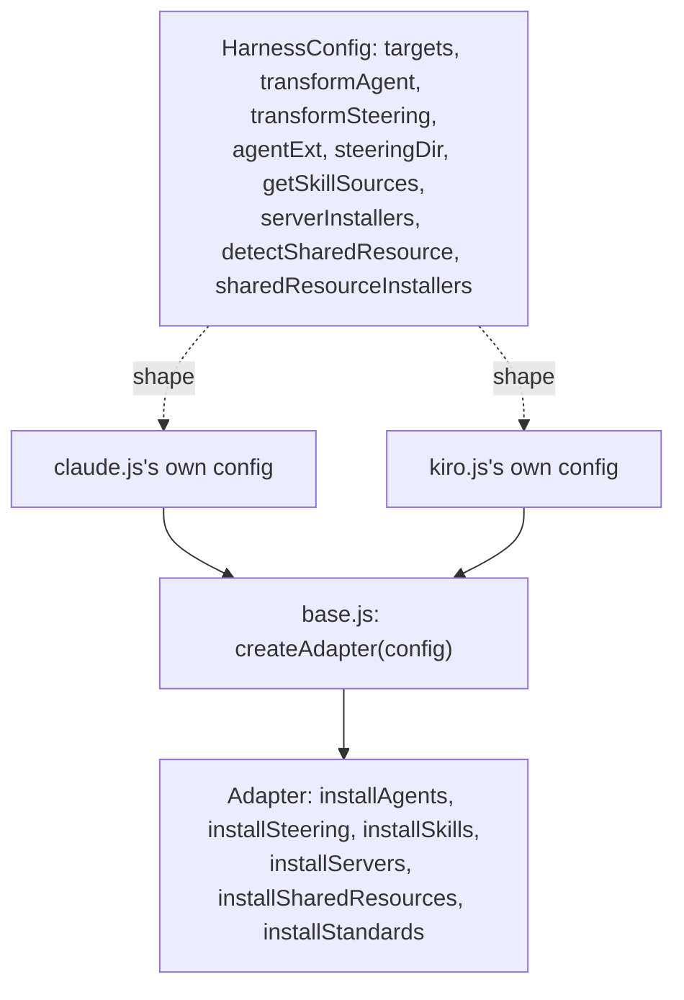

> The shared adapter contract every harness implements, and exactly where Claude
> Code and Kiro diverge — this is what portability (§1 Quality Goals) actually
> rests on.

## Overview Diagram

`base.js` owns the generic install loop — for each agent/steering/skill file: read
source, call the harness's own `transformAgent`/`transformSteering`/skill-source
resolver, write the transformed output, return a manifest-ready `{path, hash}`
record. Neither `claude.js` nor `kiro.js` re-implements that loop; they each supply
a config object closing over their own format.

## Motivation

The split is drawn at exactly the line between "true for every harness" and
"true for one harness": `base.js` holds everything harness-agnostic (the read →
transform → write → manifest-record loop), so adding a harness means writing a
new config object, never touching the loop itself — the structural mechanism
behind the portability quality goal (§1), not just a convention.

## Contained Building Blocks

### Where Claude Code and Kiro actually diverge

| Aspect                          | Claude Code (`claude.js`)                                                                                                                                                             | Kiro (`kiro.js`)                                                                                                                                                             |
| ------------------------------- | ------------------------------------------------------------------------------------------------------------------------------------------------------------------------------------- | ---------------------------------------------------------------------------------------------------------------------------------------------------------------------------- |
| `TARGETS`                       | `.claude/{agents,rules,skills,servers,standards,scripts}`, plus `~/.claude.json` for MCP settings                                                                                     | `.kiro/{agents,steering,skills,servers,standards}`, plus `.kiro/settings/mcp.json`                                                                                           |
| Agent output format             | Markdown with frontmatter (`agentExt` handled by `base.js`)                                                                                                                           | JSON                                                                                                                                                                         |
| `TOOL_MAP` shape                | Generic tool name → **array** of native tool names (a cluster, since e.g. `write` needs both `Write` and `Edit`); an empty array means "verified absent," never guessed               | Generic tool name → a **single** native name, or `null` for "verified absent" (Kiro's names are close enough to ai-foundation's own that most entries are identity mappings) |
| Tools with no native equivalent | `code` → `[]` (no LSP/code-nav tool exists in Claude Code)                                                                                                                            | `plan`, `ask_user`, `task`, `skill` → `null` (no confirmed native equivalent)                                                                                                |
| Subagent dispatch               | `subagent` → `['Agent', 'ListAgents', 'SendMessage']`                                                                                                                                 | `subagent` → `'subagent'` (identity mapping)                                                                                                                                 |
| Skill preloading                | Honors `preload_skills` via `resolvePreloadSkills()` (shared, `base.js`) — full content for listed skills goes into the subagent's frontmatter at install time                        | Ignored — Kiro always resources the full `skills` list regardless, via the shared `stripSkillPrefix` helper                                                                  |
| Shared resources                | `detectSharedResource()` + `installSharedResources()` install a shared `block-command` hook script once, referenced by every agent that needs it, instead of duplicating it per agent | No shared-resource mechanism (not yet needed for anything Kiro installs)                                                                                                     |
| MCP settings removal            | `removeMcpSetting(serverName)` edits `~/.claude.json`                                                                                                                                 | `removeMcpSetting(serverName)` edits `.kiro/settings/mcp.json`                                                                                                               |

### Steering frontmatter scoping

Steering files declare conditional loading via one harness-agnostic frontmatter
field, `file_patterns: []` (empty = always load, populated = load only for matching
files) — never a harness-native concept (Kiro's `inclusion`, Copilot's `applyTo`,
Claude Code's `paths`) directly in the source file. Each adapter translates the same
source value to its own native mechanism at install time:

| `file_patterns` value  | Kiro                     | Copilot                     | Claude Code                   |
| ---------------------- | ------------------------ | --------------------------- | ----------------------------- |
| `[]` (or omitted)      | `inclusion: "always"`    | `applyTo: "**"`             | no `paths` field              |
| `["**/*.test.js"]`     | `inclusion: "fileMatch"` | `applyTo: "**/*.test.js"`   | `paths: ["**/*.test.js"]`     |
| `["src/**", "lib/**"]` | `inclusion: "fileMatch"` | `applyTo: "src/**, lib/**"` | `paths: ["src/**", "lib/**"]` |

An earlier `applies_to` field (agent/role scoping, distinct from file-pattern
scoping) was tried and dropped: no harness supports loading part of a file based on
which agent is reading it — a steering file loads whole or not at all — so
role-scoping has to happen at bundle composition (install a different bundle per
agent) or in the agent's own `prompt`, not in steering frontmatter. See §11 Risks for
a known reliability gap in Kiro's `fileMatch` mode.

## Important Interfaces

Both adapters export the identical surface (enforced by convention, not a shared
TypeScript interface, since this codebase has none — §2 Constraints):

| Export                                                            | Purpose                                                                                                |
| ----------------------------------------------------------------- | ------------------------------------------------------------------------------------------------------ |
| `TARGETS`                                                         | Absolute install paths for this harness, keyed by component type.                                      |
| `TOOL_MAP`                                                        | Generic tool name → native name(s), or the harness's own "verified absent" marker.                     |
| `mapToolName(name)`                                               | Single-name convenience lookup (tests, logging) — not what install itself uses.                        |
| `transformAgent(agent)`                                           | Parsed `AgentDef` → this harness's native agent file content.                                          |
| `transformSteering(content)`                                      | Steering Markdown → this harness's native form.                                                        |
| `removeMcpSetting(serverName)`                                    | Uninstall-time cleanup of this harness's own MCP config file.                                          |
| `installAgents/Steering/Skills/Servers/SharedResources/Standards` | Re-exported straight from the `base.js`-built `Adapter` — the harness itself never reimplements these. |

## Consumers

For the adapter contract itself (picking an adapter by the `--harness` flag and
calling its `install*`/`removeMcpSetting` functions): `lib/commands/install.js` and
`uninstall.js` are the only callers.

`base.js` itself exports only the adapter factory (`createAdapter`) and two
skill-preload helpers (`stripSkillPrefix`, `resolvePreloadSkills`) — genuinely
harness-adapter concepts. The generic file/hash/frontmatter helpers the adapter
loop needs (`parseFrontmatter`, `collectFiles`, `hashContent`, `writeToTarget`)
live in `lib/file-utils.js` instead, since they carry no harness-specific
behavior: `claude.js` and `kiro.js` both import them from there directly (for
their own `transformSteering()` and skill/server file installation), and so do
`lib/decisions.js`/`lib/architecture.js` (`parseFrontmatter()`, to parse
MADR/arc42 YAML frontmatter) and `lib/snapshot/io.js` (`collectFiles()`/
`hashContent()`, to build source-hash snapshots). None of the latter three
touch `TARGETS`/`TOOL_MAP`/`transformAgent`/`transformSteering` or anything else
harness-specific.
