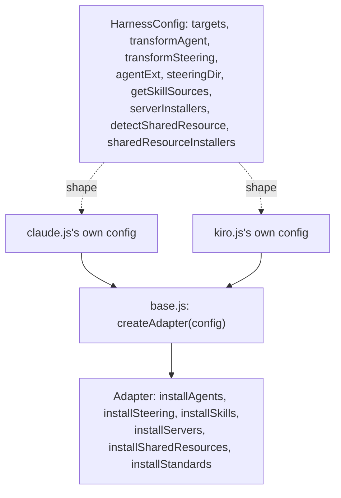

> The shared adapter contract every harness implements, and exactly where Claude
> Code and Kiro diverge — this is what portability (§1 Quality Goals) actually
> rests on.

## Overview Diagram

```mermaid
graph TD
  Config["HarnessConfig: targets, transformAgent, transformSteering,\nagentExt, steeringDir, getSkillSources,\nserverInstallers, detectSharedResource, sharedResourceInstallers"]
  CreateAdapter["base.js: createAdapter(config)"]
  Adapter["Adapter: installAgents, installSteering, installSkills,\ninstallServers, installSharedResources, installStandards"]

  ClaudeConfig["claude.js's own config"] --> CreateAdapter
  KiroConfig["kiro.js's own config"] --> CreateAdapter
  Config -. shape .-> ClaudeConfig
  Config -. shape .-> KiroConfig
  CreateAdapter --> Adapter
```

`base.js` owns the generic install loop — for each agent/steering/skill file: read
source, call the harness's own `transformAgent`/`transformSteering`/skill-source
resolver, write the transformed output, return a manifest-ready `{path, hash}`
record. Neither `claude.js` nor `kiro.js` re-implements that loop; they each supply
a config object closing over their own format.

## Motivation

The split is drawn at exactly the line between "true for every harness" and
"true for one harness": `base.js` holds everything harness-agnostic (the read →
transform → write → manifest-record loop), so adding a harness means writing a
new config object, never touching the loop itself — the structural mechanism
behind the portability quality goal (§1), not just a convention.

## Contained Building Blocks

### Where Claude Code and Kiro actually diverge

| Aspect                                 | Claude Code (`claude.js`)                                                                                                                                                                                                                                                                                                                                                                                                                               | Kiro (`kiro.js`)                                                                                                                                                       |
| -------------------------------------- | ------------------------------------------------------------------------------------------------------------------------------------------------------------------------------------------------------------------------------------------------------------------------------------------------------------------------------------------------------------------------------------------------------------------------------------------------------- | ---------------------------------------------------------------------------------------------------------------------------------------------------------------------- |
| `TARGETS`                              | `~/.claude/{agents,rules,skills,servers,standards,scripts}`, plus `~/.claude.json` for MCP settings                                                                                                                                                                                                                                                                                                                                                     | `~/.kiro/{agents,steering,skills,servers,standards}`, plus `~/.kiro/settings/mcp.json`                                                                                 |
| Agent output format                    | Markdown with frontmatter (`agentExt` handled by `base.js`)                                                                                                                                                                                                                                                                                                                                                                                             | JSON                                                                                                                                                                   |
| `TOOL_MAP` shape                       | Generic tool name → **array** of native tool names (a cluster, since e.g. `write` needs both `Write` and `Edit`), or the shared `UNSUPPORTED` marker for "verified absent," never guessed                                                                                                                                                                                                                                                               | Same shape: an array (single-element identity mappings, since Kiro's names are close to ai-foundation's own), or the shared `UNSUPPORTED` marker for "verified absent" |
| Tools with no native equivalent        | `code` → `UNSUPPORTED` (no LSP/code-nav tool exists in Claude Code)                                                                                                                                                                                                                                                                                                                                                                                     | `plan`, `ask_user`, `task`, `skill` → `UNSUPPORTED` (no confirmed native equivalent)                                                                                   |
| MCP tool references                    | `@server/tool` in an agent's `tools` is rewritten to Claude Code's native `mcp__server__tool` by `mapMcpToolRef()` (characters outside `[A-Za-z0-9_-]` become `_`); Claude Code silently ignores the `@` form                                                                                                                                                                                                                                           | `@server/tool` passes through unchanged (Kiro's own notation)                                                                                                          |
| Platform-tool groups (ADR 0007)        | `session_info`, `pr_follow_through`, `repo_list`, `session_control`, `repo_scope`, `routines` (named in `TOOLS`, `lib/constants.js`) each map to a cluster of `mcp__claude-code-remote__*` names; `pr_follow_through` also includes the core tool `ReadNotifications` (PR events arrive only through it). The `routines` names (including plural `list_triggers`) were confirmed against a real cloud session tool listing (2026-10-03, human-verified) | All six → `UNSUPPORTED` (no verified agent-callable equivalent)                                                                                                        |
| Foreign `@claude-code-remote/...` refs | Passed through as `mcp__claude-code-remote__*`                                                                                                                                                                                                                                                                                                                                                                                                          | Dropped and reported via `FOREIGN_SERVERS` (Kiro silently ignores them, so passthrough would imply a grant); other `@server/tool` refs still pass through              |
| Subagent dispatch                      | `subagent` → `['Agent', 'ListAgents', 'SendMessage']`                                                                                                                                                                                                                                                                                                                                                                                                   | `subagent` → `'subagent'` (identity mapping)                                                                                                                           |
| Skill preloading                       | Honors `preload_skills` via `resolvePreloadSkills()` (shared, `base.js`) — full content for listed skills goes into the subagent's frontmatter at install time                                                                                                                                                                                                                                                                                          | Ignored — Kiro always resources the full `skills` list regardless, via the shared `stripSkillPrefix` helper                                                            |
| Shared resources                       | `detectSharedResource()` + `installSharedResources()` install a shared `block-command` hook script once, referenced by every agent that needs it, instead of duplicating it per agent                                                                                                                                                                                                                                                                   | No shared-resource mechanism (not yet needed for anything Kiro installs)                                                                                               |
| `blocked_commands` enforcement         | A `PreToolUse` hook on the `Bash` tool runs the installed `block-command` script (see "The `block-command` hook")                                                                                                                                                                                                                                                                                                                                       | Emitted as a shell `deny` permission rule in the agent JSON; its matching semantics are unverified and unchanged                                                       |
| MCP settings removal                   | `removeMcpSetting(serverName)` edits `~/.claude.json`                                                                                                                                                                                                                                                                                                                                                                                                   | `removeMcpSetting(serverName)` edits `.kiro/settings/mcp.json`                                                                                                         |

### The `block-command` hook

> Claude Code only. Added by AIF-007; replaces a start-of-string glob match that compound commands, pipes, env prefixes, absolute paths and wrappers all bypassed.

Claude Code subagent frontmatter has no permissions field, so `transformAgent()` emits a `PreToolUse` hook (matcher `Bash`) for any agent with a non-empty `blocked_commands`. `buildHookCommand()` runs the installed `block-command/cli.js` (under `TARGETS.scripts`) with each pattern as an argument, through the absolute path of the Node binary that ran `aif install`, and `installBlockCommandResource()` copies exactly `logic.js` and `cli.js` there, so both files must stay dependency-free with no build step.

`cli.js` is the thin I/O wrapper: it reads the hook payload from stdin, takes `tool_input.command`, and exits 2 with a message on stderr when `logic.js` reports a match, otherwise 0. `logic.js` is pure and has no I/O. A hand-written, zero-dependency tokenizer splits the command line into simple commands, normalizes each, and applies every `blocked_commands` glob to each one:

- **Splitting.** Compound commands (`;`, `&&`, `||`, `&`, newlines), pipes, subshells and groups, and control-flow bodies each yield their own simple commands. The glob semantics are unchanged (`*` matches any sequence); additionally a trailing ` *` matches the bare command, so `git *` blocks plain `git`.
- **Normalization.** Leading `VAR=value` assignments are stripped, then wrapper commands and their own flags (`env`, `sudo`, `doas`, `nohup`, `time`, `timeout`, `flock`, `xargs`, `nice`, `command`, `exec` and similar), then the executable is reduced to its basename and quoting or escaping of the command word is removed (`"git"`, `\git` and `gi""t` all read as `git`). Commands that only mention a blocked word (`echo "git status"`, `grep git README.md`, `git-lfs`) are not matches.
- **Secrets-manager wrappers.** `bws run`, `op run` and `doppler run` are unwrapped after their own flags, so `bws run -- git log` is blocked while `bws run -- ai-git push` runs.
- **Re-entry.** The hook recurses into `bash|sh|zsh|dash|ksh|ash -c`, `eval` with a literal argument, `find -exec`, command substitution, process substitution, and command substitutions inside heredoc bodies that are subject to expansion. A quoted heredoc body is data and is not matched.
- **Dynamic command words block.** If the executable cannot be named statically (`$g log`, `"$GIT" log`, `$(echo git) log`, an unquoted glob or brace pattern, `eval` of a non-literal argument), the line is blocked for any agent with at least one blocked pattern, and the message asks for a literal command word. A variable used as a path prefix with a literal basename (`$HOME/.local/bin/tool`) is allowed.
- **Failure behaviour.** The parser never throws: unbalanced constructs are treated as literal text, nesting beyond fixed limits stops parsing at that point, and any internal error or malformed payload fails open (exit 0).
- **Block message.** Names the matched pattern (or the dynamic-word reason), says to use `ai-git`, and says an agent must never supply, infer or ask for a git identity.

The hook is workflow discipline, not a security boundary.

**Residual gaps** (allowed or unverified by design, since command text alone cannot close them):

- Interpreters that call the blocked tool internally (`python -c`, `node -e`), scripts and build tools (`make`, `npm run x`, a repo script), and shell functions or aliases defined in earlier commands.
- Scripts fed to a shell on stdin, via process substitution, or as heredoc or here-string input: `printf 'git log' | sh`, `bash <(echo git log)`, `bash <<EOF` and `bash <<< 'git log'` are allowed. Running a script file (`bash x.sh`) is likewise not inspected.
- Windows naming is not normalized: only `/` splits a path and no `.exe` suffix is stripped, so `git.exe` does not match `git *` and a backslash is read as an escape rather than a path separator.
- Parsing of `[[ ]]`, `case` and array assignments is best-effort and can produce a missed or extra match.
- The shell list (`bash`, `sh`, `zsh`, `dash`, `ksh`, `ash`; not fish, csh, tcsh or busybox) and the wrapper list (not `su -c`, `ssh`, `parallel`, `strace`, `nsenter`, `runuser`, `systemd-run` and others) are fixed, non-exhaustive sets.
- The `secrets.run` prefix from `.aiconfig.json` is not passed to the hook, because `buildHookCommand()` passes only the patterns. The built-in `bws`, `op` and `doppler` handling works without it, but a custom wrapper outside those would slip through.
- Fail-open: input crafted so the parser misreads what bash runs is allowed.
- Kiro's `deny` rules are unchanged and unverified.

### Steering frontmatter scoping

Steering files declare conditional loading via one harness-agnostic frontmatter
field, `file_patterns: []` (empty = always load, populated = load only for matching
files) — never a harness-native concept (Kiro's `inclusion`, Copilot's `applyTo`,
Claude Code's `paths`) directly in the source file. Each adapter translates the same
source value to its own native mechanism at install time:

| `file_patterns` value  | Kiro                     | Copilot                     | Claude Code                   |
| ---------------------- | ------------------------ | --------------------------- | ----------------------------- |
| `[]` (or omitted)      | `inclusion: "always"`    | `applyTo: "**"`             | no `paths` field              |
| `["**/*.test.js"]`     | `inclusion: "fileMatch"` | `applyTo: "**/*.test.js"`   | `paths: ["**/*.test.js"]`     |
| `["src/**", "lib/**"]` | `inclusion: "fileMatch"` | `applyTo: "src/**, lib/**"` | `paths: ["src/**", "lib/**"]` |

An earlier `applies_to` field (agent/role scoping, distinct from file-pattern
scoping) was tried and dropped: no harness supports loading part of a file based on
which agent is reading it — a steering file loads whole or not at all — so
role-scoping has to happen at bundle composition (install a different bundle per
agent) or in the agent's own `prompt`, not in steering frontmatter. See §11 Risks for
a known reliability gap in Kiro's `fileMatch` mode.

### Tool-mapping contract

Both adapters resolve an agent's `tools`/`approved_tools` through `base.js`'s
`resolveTools()`, each name landing in one of three states: **mapped** (a
`TOOL_MAP` array), **unsupported** (the shared `UNSUPPORTED` marker — dropped, and
reported), or **passthrough** (a well-formed `@server/tool` reference, rewritten by
the adapter's own `mapRef`). Any other bare name throws `UnknownToolError`; `aif
validate` rejects the same names (`isKnownToolName()`). The resolved list is
deduplicated, so a tool shared by several `TOOLS` entries is granted once. An adapter may
list `foreignServers` (Kiro: `claude-code-remote`); a reference to one resolves as
**unsupported** rather than passthrough.
`installAgents()` transforms every agent before writing any, so an unknown tool fails
the install naming the agent and tool with no partial output, and prints one
`dropped for <harness>: ...` line per agent that lost tools. `tests/unit/adapter-contract.test.js`
runs the same assertions against every adapter.

## Important Interfaces

Both adapters export the identical surface (enforced by convention, not a shared
TypeScript interface, since this codebase has none — §2 Constraints):

| Export                                                            | Purpose                                                                                                                                                    |
| ----------------------------------------------------------------- | ---------------------------------------------------------------------------------------------------------------------------------------------------------- |
| `TARGETS`                                                         | Absolute install paths for this harness, keyed by component type.                                                                                          |
| `TOOL_MAP`                                                        | Generic tool name → array of native names, or the shared `UNSUPPORTED` marker.                                                                             |
| `mapToolName(name)`                                               | Single-name convenience lookup (tests, logging): first native name, `null` when unsupported, throws on an unknown bare name. Not what install itself uses. |
| `transformAgent(agent, dropped?)`                                 | Parsed `AgentDef` → this harness's native agent file content; pushes names dropped as unsupported onto `dropped`.                                          |
| `transformSteering(content)`                                      | Steering Markdown → this harness's native form.                                                                                                            |
| `removeMcpSetting(serverName)`                                    | Uninstall-time cleanup of this harness's own MCP config file.                                                                                              |
| `installAgents/Steering/Skills/Servers/SharedResources/Standards` | Re-exported straight from the `base.js`-built `Adapter` — the harness itself never reimplements these.                                                     |

## Consumers

For the adapter contract itself (picking an adapter by the `--harness` flag and
calling its `install*`/`removeMcpSetting` functions): `lib/commands/install.js` and
`uninstall.js` are the only callers.

`base.js` itself exports only the adapter factory (`createAdapter`), two
skill-preload helpers (`stripSkillPrefix`, `resolvePreloadSkills`), and the
tool-mapping contract (see "Tool-mapping contract" above: `UNSUPPORTED`,
`resolveTool`, `resolveTools`, `mapSingleTool`, `isMcpToolRef`, `isKnownToolName`,
`MCP_TOOL_REF`, `UnknownToolError`) — genuinely harness-adapter concepts. The generic file/hash/frontmatter helpers the adapter
loop needs (`parseFrontmatter`, `collectFiles`, `hashContent`, `writeToTarget`)
live in `lib/file-utils.js` instead, since they carry no harness-specific
behavior: `claude.js` and `kiro.js` both import them from there directly (for
their own `transformSteering()` and skill/server file installation), and so do
`lib/decisions.js`/`lib/architecture.js` (`parseFrontmatter()`, to parse
MADR/arc42 YAML frontmatter) and `lib/snapshot/io.js` (`collectFiles()`/
`hashContent()`, to build source-hash snapshots). None of the latter three
touch `TARGETS`/`TOOL_MAP`/`transformAgent`/`transformSteering` or anything else
harness-specific.
