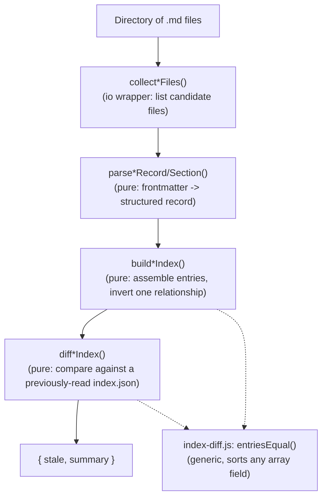

> How `aif index decisions` and `aif index architecture` each turn a directory of
> Markdown files into a diffable `index.json` — one shared pipeline shape,
> currently instantiated for two document types (ADRs and arc42 sections), two
> different frontmatter formats and identity/relationship rules.

## Overview Diagram

Both `*ForDir()` io wrappers (`buildDecisionIndexForDir`, `buildArchitectureIndexForDir`)
run the collect → parse → build steps end to end; `lib/commands/index.js` calls the
diff step itself, against whatever `index.json` is already on disk.

## Motivation

`decisions.js`, `architecture.js`, and `index-diff.js` form a genuinely cohesive
subsystem, not three unrelated files bundled together: both indexers parse a
Markdown file's frontmatter into a record, assemble an index, invert one
relationship across the whole set, and diff against a previously-committed
index — sharing the one generic comparison primitive (`index-diff.js`) rather
than each hand-rolling their own. The pipeline itself is `aif index`'s own
general-purpose shape, not tied to ADRs and arc42 sections specifically — a
third document type is expected to reuse it by adding a third
`parse*`/`build*`/`diff*` set, not a new architecture.

## Contained Building Blocks

| Aspect                          | `decisions.js` (ADRs)                                                                                                       | `architecture.js` (arc42 sections)                                                                                                                                                                                   |
| ------------------------------- | --------------------------------------------------------------------------------------------------------------------------- | -------------------------------------------------------------------------------------------------------------------------------------------------------------------------------------------------------------------- |
| Source format                   | MADR frontmatter (`status`/`date`/`decision-makers`/`tags`/`links.supersedes`/`affects`) + a plain `# {title}` H1           | arc42 frontmatter (`section`/`title`/`lifecycle`/`tags`/`key_files`/`last_verified`) + a one-line `>` blockquote summary                                                                                             |
| Identity                        | The filename's own zero-padded number (`ID_PATTERN = /^(\d{4})-/`) — no `id` frontmatter field                              | The file's `path`, relative to `paths.architecture` — arc42 sections have no separate ID scheme                                                                                                                      |
| File discovery                  | Flat, non-recursive (`docs/decisions/` has no subfolders for the live corpus); `_`-prefixed and non-`NNNN-*` names excluded | Recursive; `_`-prefixed files (e.g. `_template.md`) excluded                                                                                                                                                         |
| Inverted relationship           | `links.supersedes` → `superseded_by`                                                                                        | `key_files` → `reverse_index` (`source path → [doc paths]`), via `buildReverseIndex()`                                                                                                                               |
| Extra validation beyond parsing | None — a well-formed record is never marked stale by `decisions.js` itself                                                  | `isStaleAgainstGit()`: `git log <last_verified>..HEAD -- <key_file>` per `key_file`, plus an unconditional stale if a `key_file` is missing from disk right now (see its own doc comment for why order matters here) |
| Diff key                        | `id`                                                                                                                        | `path`                                                                                                                                                                                                               |

Both parse their frontmatter via the same `parseFrontmatter()` helper
(`lib/file-utils.js` — see §5.02's Consumers section for the other consumers of
that same generic-utility module), and both diff via
`index-diff.js`'s `entriesEqual()`, which sorts every array-valued field generically
rather than hardcoding either entry shape's field list — the same function serves
`decisions.js`'s `supersedes`/`superseded_by`/`tags`/`affects`/`decision_makers` and
`architecture.js`'s `tags`/`key_files` without either module needing to know about
the other's fields.

## Important Interfaces

| Block             | Pure functions                                                                                                                       | io wrappers                                                                                                |
| ----------------- | ------------------------------------------------------------------------------------------------------------------------------------ | ---------------------------------------------------------------------------------------------------------- |
| `decisions.js`    | `parseDecisionRecord()`, `buildDecisionIndex()`, `diffDecisionIndex()`                                                               | `collectDecisionFiles()`, `buildDecisionIndexForDir()`                                                     |
| `architecture.js` | `parseArchitectureSection()`, `buildReverseIndex()`, `buildArchitectureIndex()`, `diffArchitectureIndex()`, `extractRelativeLinks()` | `collectArchitectureFiles()`, `isStaleAgainstGit()`, `findBrokenLinks()`, `buildArchitectureIndexForDir()` |
| `index-diff.js`   | `entriesEqual()`                                                                                                                     | —                                                                                                          |

`architecture.js`'s split is slightly wider than `decisions.js`'s: `isStaleAgainstGit()`
is the one piece of either module that touches git/the filesystem beyond reading the
target directory, so `buildArchitectureIndex()` takes staleness as an injected
predicate rather than computing it inline — keeping the assembly step itself pure and
testable against synthetic fixtures with no real repo, per
`steering/engineering/core.md`'s testability rule.

## Consumers

`lib/commands/index.js` is the sole caller of both `build*IndexForDir()` functions,
both `diff*Index()` functions, and `architecture.js`'s `findBrokenLinks()` — arc42
sections' own cross-references are relative markdown links between flat sibling
files, so only `architecture.js` scans for broken ones; `decisions.js` records have
no equivalent link convention to check. `aif index decisions|architecture` and their
`--check` mode are the only entry points into either module. Nothing else in this
repo imports `decisions.js`, `architecture.js`, or `index-diff.js` directly.
