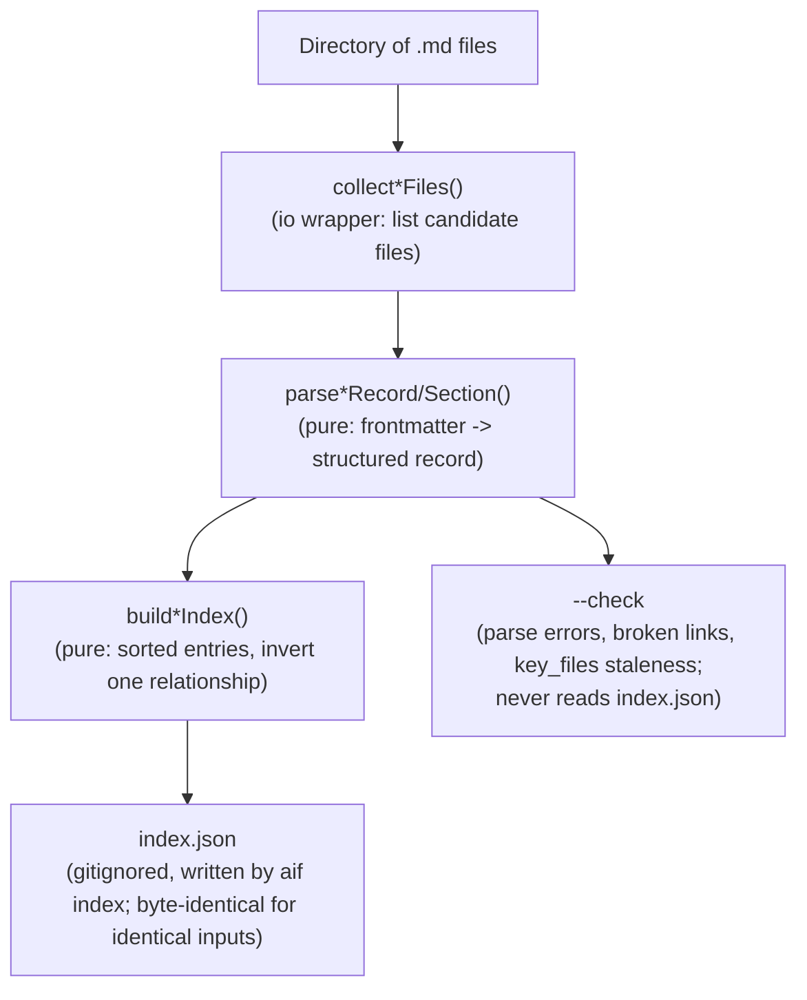

> How `aif index decisions` and `aif index architecture` each turn a directory of
> Markdown files into a deterministic, on-demand `index.json` — one shared pipeline
> shape, currently instantiated for two document types (ADRs and arc42 sections),
> two different frontmatter formats and identity/relationship rules.

## Overview Diagram

```mermaid
flowchart TD
  Files["Directory of .md files"] --> Collect["collect*Files()\n(io wrapper: list candidate files)"]
  Collect --> Parse["parse*Record/Section()\n(pure: frontmatter -> structured record)"]
  Parse --> Build["build*Index()\n(pure: sorted entries, invert one relationship)"]
  Build --> Out["index.json\n(gitignored, written by aif index; byte-identical for identical inputs)"]
  Parse --> Check["--check\n(parse errors, broken links, key_files staleness;\nnever reads index.json)"]
```

Both `*ForDir()` io wrappers (`buildDecisionIndexForDir`, `buildArchitectureIndexForDir`)
run the collect → parse → build steps end to end; `lib/commands/index.js` writes the
result to `index.json` or, under `--check`, validates the parsed sources directly.

## Motivation

`decisions.js` and `architecture.js` form a cohesive subsystem: both indexers parse
a Markdown file's frontmatter into a record, assemble a sorted index, and invert one
relationship across the whole set. The index is generated on demand and is not
committed (`docs/architecture/index.json` and `docs/decisions/index.json` are
gitignored): nothing generated lives on `main`, so parallel branches cannot conflict
on it. Generation is deterministic (entries sorted by identity, no timestamp, no
per-entry staleness), and `--check` never reads a stored index. The pipeline itself
is `aif index`'s own general-purpose shape, not tied to ADRs and arc42 sections
specifically — a third document type is expected to reuse it by adding a third
`parse*`/`build*` set, not a new architecture.

## Contained Building Blocks

| Aspect                          | `decisions.js` (ADRs)                                                                                                       | `architecture.js` (arc42 sections)                                                                                                                                                                                   |
| ------------------------------- | --------------------------------------------------------------------------------------------------------------------------- | -------------------------------------------------------------------------------------------------------------------------------------------------------------------------------------------------------------------- |
| Source format                   | MADR frontmatter (`status`/`date`/`decision-makers`/`tags`/`links.supersedes`/`affects`) + a plain `# {title}` H1           | arc42 frontmatter (`section`/`title`/`lifecycle`/`tags`/`key_files`/`last_verified`) + a one-line `>` blockquote summary                                                                                             |
| Identity                        | The filename's own zero-padded number (`ID_PATTERN = /^(\d{4})-/`) — no `id` frontmatter field                              | The file's `path`, relative to `paths.architecture` — arc42 sections have no separate ID scheme                                                                                                                      |
| File discovery                  | Flat, non-recursive (`docs/decisions/` has no subfolders for the live corpus); `_`-prefixed and non-`NNNN-*` names excluded | Recursive; `_`-prefixed files (e.g. `_template.md`) excluded                                                                                                                                                         |
| Inverted relationship           | `links.supersedes` → `superseded_by`                                                                                        | `key_files` → `reverse_index` (`source path → [doc paths]`), via `buildReverseIndex()`                                                                                                                               |
| Extra validation beyond parsing | None — `--check` is parse validation only                                                                                   | `isStaleAgainstGit()`: `git log <last_verified>..HEAD -- <key_file>` per `key_file`, plus an unconditional stale if a `key_file` is missing from disk right now (see its own doc comment for why order matters here) |
| Sort key                        | `id`                                                                                                                        | `path`                                                                                                                                                                                                               |

Both parse their frontmatter via the same `parseFrontmatter()` helper
(`lib/file-utils.js` — see §5.02's Consumers section for the other consumers of
that same generic-utility module).

## Important Interfaces

| Block             | Pure functions                                                                                            | io wrappers                                                                                                                                                |
| ----------------- | --------------------------------------------------------------------------------------------------------- | ---------------------------------------------------------------------------------------------------------------------------------------------------------- |
| `decisions.js`    | `parseDecisionRecord()`, `buildDecisionIndex()`                                                           | `collectDecisionFiles()`, `buildDecisionIndexForDir()`                                                                                                     |
| `architecture.js` | `parseArchitectureSection()`, `buildReverseIndex()`, `buildArchitectureIndex()`, `extractRelativeLinks()` | `collectArchitectureFiles()`, `loadArchitectureRecords()`, `isStaleAgainstGit()`, `findStaleDocs()`, `findBrokenLinks()`, `buildArchitectureIndexForDir()` |

`architecture.js`'s split is slightly wider than `decisions.js`'s: `isStaleAgainstGit()`
is the one piece of either module that touches git beyond reading the target
directory, so it is kept out of `buildArchitectureIndex()` entirely — the assembly
step stays pure and testable against synthetic fixtures with no real repo, per
`steering/engineering/core.md`'s testability rule, and `findStaleDocs()` computes
staleness separately for `--check`.

## Consumers

`lib/commands/index.js` is the sole caller of `decisions.js`'s `buildDecisionIndexForDir()`
and of `architecture.js`'s `loadArchitectureRecords()`, `buildArchitectureIndex()`,
`findStaleDocs()`, and `findBrokenLinks()` — arc42
sections' own cross-references are relative markdown links between flat sibling
files, so only `architecture.js` scans for broken ones; `decisions.js` records have
no equivalent link convention to check. `aif index decisions|architecture` and their
`--check` mode are the only entry points into either module. Nothing else in this
repo imports `decisions.js` or `architecture.js` directly.
