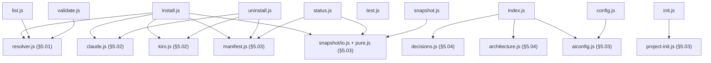

> One file per `aif <verb>` subcommand — what each one actually resolves, reads,
> or writes, and which Core libraries/Harness adapters it calls straight into.

## Overview Diagram

`test.js` has no edge — it only shells out to this repo's own `node:test` runner
(`execSync`), no library dependency.

## Motivation

Ten files sharing one uniform shape (parse this command's own args, call straight
into whichever Core library/Harness adapter does the real work, return) — genuinely
one cohesive whitebox, not six unrelated responsibilities the way §5.03 is. The
split from `05_building_blocks.md` isn't because any single command is complex
enough to need its own diagram (none is); it's the same `key_files`-list-length
reasoning §5.03 already gives for its own existence: ten files' individual
freshness needs somewhere to be tracked without bloating the Level-1 doc's own
list past what keeps a rename or deletion there a meaningful signal.

## Contained Building Blocks

| Block          | Responsibility                                                                                                                     | Interface                                                                           |
| -------------- | ---------------------------------------------------------------------------------------------------------------------------------- | ----------------------------------------------------------------------------------- |
| `install.js`   | Resolves a bundle via `resolver.js`, writes its components through the target harness adapter, records the result in the manifest. | `runInstall(parsed, repoRoot)`                                                      |
| `uninstall.js` | Removes previously-installed files using the manifest's recorded file list; per-harness settings cleanup (e.g. MCP entries).       | `runUninstall(parsed, repoRoot)`                                                    |
| `status.js`    | Reports what's installed vs. current source state (staleness) for a project.                                                       | `runStatus(parsed, repoRoot)`                                                       |
| `list.js`      | Lists available bundles/agents/skills/servers in this repo. No `standards` target.                                                 | `runList(parsed, repoRoot)`                                                         |
| `validate.js`  | Schema, cross-reference, and bundle-resolution integrity checks (`aif validate`).                                                  | `runValidate(parsed, repoRoot)`                                                     |
| `test.js`      | Thin wrapper invoking this repo's own `node:test` suite.                                                                           | `runTest(parsed, repoRoot)`                                                         |
| `snapshot.js`  | Builds/reads per-bundle, per-server, and per-hook source-hash snapshots.                                                           | `runSnapshot(parsed, repoRoot)`                                                     |
| `index.js`     | Generates the decisions and architecture indexes (`aif index decisions\|architecture`).                                            | `runIndex(parsed, repoRoot)`, `resolveDecisionsPath()`, `resolveArchitecturePath()` |
| `init.js`      | Scaffolds a new project from `projects/_template/`, interactively or via flags.                                                    | `runInit(parsed, repoRoot)`, `promptForConfig()`                                    |
| `config.js`    | Resolves a single `.aiconfig.json` field to its configured value or documented default (`aif config <key>`).                       | `runConfig(parsed, cwd)`                                                            |

## Consumers

`bin/aif.js` is the sole caller of every command in this table — it parses argv
and dispatches to exactly one `run*()` handler per invocation (§5 Entry points).
`install.js` also calls back into its own `snapshot.js` (`readSnapshot`,
`readServerSnapshot`, `readHookSnapshot`) and `status.js` does the same, since
freshness-checking at install/status time reuses the same reader `snapshot.js`
itself uses to build those snapshots in the first place.
