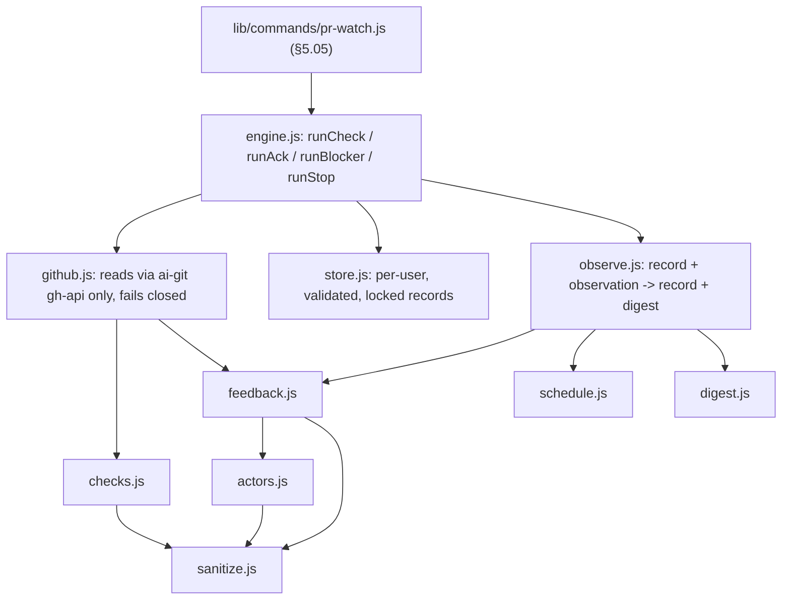

> The deterministic half of `skill/pr-stewardship`: one pass reads a PR's state
> fresh through `ai-git`, diffs it against a remembered record, and returns a
> digest — the same way no matter what woke the session.

## Overview Diagram

`engine.js`, `github.js` and `store.js` are the only modules that touch the
outside world; the other seven are pure (data in, data out).

## Motivation

A PR pass has parts that must behave identically every time — classifying CI,
remembering what was already seen, deciding who may trigger a change, when to check
next, when to stop — and parts that need judgment. Prose procedures get skipped or
drifted from; code does not. So the first group lives here and the skill says "run
the helper and obey its digest", leaving only judgment (fixing a failure,
evaluating a permitted request, what to say) to the agent. Wake-independence is
structural: a cloud notification, a poll tick and a manual run all call the same
`runCheck`, which takes no event payload and re-fetches everything itself, so the
wake mechanism is the only thing that varies.

It is a CLI over pure modules rather than an MCP server, by the human's decision on
plan AIF-010 Q11 (2026-10-05). ADR 0004 defaults shared deterministic cross-harness
tooling to MCP, and ADR 0005 kept `ai-git` a CLI because it holds credentials and
an open-ended surface; the helper holds no credentials of its own because it
reaches GitHub only by spawning `ai-git gh-api`, and an `aif` subcommand needs no
install or registration step beyond the `aif` already on every session's PATH. The
pure core can sit behind an MCP wrapper later at low cost. The ten `key_files` form
one pipeline with no finer boundary a reader would use, so the split trigger was
weighed and not applied.

## Contained Building Blocks

| Block         | Responsibility                                                                                                                                                                                                                                                                                                                                                                                                                                                                                                                                                                                                                                                                                                                                                                                                                                                                                                                                                                               | Interface                                                                                           |
| ------------- | -------------------------------------------------------------------------------------------------------------------------------------------------------------------------------------------------------------------------------------------------------------------------------------------------------------------------------------------------------------------------------------------------------------------------------------------------------------------------------------------------------------------------------------------------------------------------------------------------------------------------------------------------------------------------------------------------------------------------------------------------------------------------------------------------------------------------------------------------------------------------------------------------------------------------------------------------------------------------------------------- | --------------------------------------------------------------------------------------------------- |
| `sanitize.js` | Shrinks every third-party string to a safe bounded shape: logins to GitHub's login shape or null, associations to the documented enum or null, URLs to github.com https or null, ids to positive integers, free text (check names) stripped of control characters and of invisible format, private-use, unassigned and surrogate code points (bidi overrides, zero-width, tag characters) and truncated to 80. ASCII-only lower-casing, so look-alikes such as the Kelvin sign never fold onto a login.                                                                                                                                                                                                                                                                                                                                                                                                                                                                                      | `sanitizeText()`, `sanitizeLogin()`, `sanitizeUrl()`, `asciiLower()`, ...                           |
| `actors.js`   | The one permitted-actor rule: PR author, caller-supplied human, or (non-bot) `OWNER`/`MEMBER`/`COLLABORATOR` by API `author_association`; everyone else escalates. Reads structured metadata only, never text.                                                                                                                                                                                                                                                                                                                                                                                                                                                                                                                                                                                                                                                                                                                                                                               | `classifyActor()`, `isBot()`, `PERMITTED_ASSOCIATIONS`                                              |
| `checks.js`   | Classifies check-runs and legacy statuses into green/pending/red per check and overall; an unknown conclusion is red, an empty list is `none`; flags a red check already red on the base branch. "Green" means every check returned is green: no required-check or `mergeable_state` awareness.                                                                                                                                                                                                                                                                                                                                                                                                                                                                                                                                                                                                                                                                                              | `classifyCheckRun()`, `classifyStatus()`, `evaluateChecks()`                                        |
| `feedback.js` | Reduces reviews and comments to sanitized metadata (no body), then splits unhandled ones into `act` (permitted) and `escalate`. The caller-named `self` login's items are skipped; with `self` unset the PR author is held back as `escalate` (`self_unset_author`) rather than treated as permitted; an edit re-surfaces an item. Reviews carry no edit marker, so a review-body edit is not observable.                                                                                                                                                                                                                                                                                                                                                                                                                                                                                                                                                                                    | `normalizeFeedback()`, `triageFeedback()`, `apiPath()`                                              |
| `schedule.js` | Stop conditions (merged, closed, landed, explicit, blocker reported, 48 hours with no change that matters to the agent, a 7-day absolute age ceiling) and the cadence (pending backoff to a ceiling, a pending cap reported once, human-wait backoff), as data.                                                                                                                                                                                                                                                                                                                                                                                                                                                                                                                                                                                                                                                                                                                              | `evaluateStop()`, `planNext()`, `CADENCE`                                                           |
| `digest.js`   | Derives a status and mergeable state from an observation, names the digest fields that carry third-party data (`UNTRUSTED_FIELDS`), and renders the one-line summary.                                                                                                                                                                                                                                                                                                                                                                                                                                                                                                                                                                                                                                                                                                                                                                                                                        | `deriveStatus()`, `deriveMergeable()`, `summarize()`                                                |
| `observe.js`  | The pure core: record and observation in, next record and digest out (transitions only; a permitted request stays listed until acknowledged; an escalated one is reported once; only head, status, mergeable and permitted-feedback changes reset the quiet timer). `human` and `self` are per-call inputs, never part of the record. Never mutates its input.                                                                                                                                                                                                                                                                                                                                                                                                                                                                                                                                                                                                                               | `newRecord()`, `observe()`, `acknowledge()`                                                         |
| `github.js`   | Reads PR, check, status and feedback endpoints, or a branch and its comparison with the base, only through `ai-git gh-api`; refuses non-repository and dot-segment paths. Fails closed: a failed call, truncated or non-array response, or a list with more than 1000 items throws (exactly 1000 is read completely) and no digest is produced. A missing branch counts as landed only when this watch saw it before and the base now holds its last known tip. The `ai-git` override for tests is honored only when `NODE_ENV=test`.                                                                                                                                                                                                                                                                                                                                                                                                                                                        | `makeGhApi()`, `runAiGit()`, `fetchPrObservation()`, `fetchBranchObservation()`                     |
| `store.js`    | One JSON record per consumer and target under a per-user temp directory. The directory must be a real directory owned by the user with mode 0700 (POSIX; on Windows the per-user temp ACL is relied on); files are created exclusively (`wx`, random suffix, 0600) and renamed; a record is validated against a strict schema and its own path, and an invalid, tampered or symlinked one is discarded. Only the short read-modify-write (never the network fetch) is serialised, by a lock directory holding an owner token: a lock older than 30 seconds is treated as abandoned and replaced, and a holder releases only a lock that still carries its own token. The repo name is percent-encoded in the file name so `a__b/c` and `a/b__c` differ, and check names (third-party text, possibly `__proto__`) are kept as own data on null-prototype objects so a record always round-trips. A caller-supplied `--state-dir` is trusted as given. Records hold logins, IDs and SHAs only. | `statePath()`, `ensureSafeDir()`, `validateRecord()`, `readRecord()`, `writeRecord()`, `withLock()` |
| `engine.js`   | One pass: load the record, fetch fresh, `observe`, persist (or drop the record on stop), return the digest; nothing is persisted when any read failed. Plus `ack`, `blocker` and `stop`.                                                                                                                                                                                                                                                                                                                                                                                                                                                                                                                                                                                                                                                                                                                                                                                                     | `runCheck()`, `runAck()`, `runBlocker()`, `runStop()`                                               |

Limit: lists are read oldest first up to 1000 items; a PR with more fails the pass
loudly rather than being read partially. A caller that omits `--self` gets a
`self_unset` warning, never silent trust.

## Consumers

`lib/commands/pr-watch.js` (§5.05), wired into `bin/aif.js` as `aif pr-watch`, is
the only caller. `skills/pr-stewardship/SKILL.md` tells agents to run it; the
skill cites it and does not restate the actor rule, cadence numbers, stop
conditions or record shape, which this block owns.
