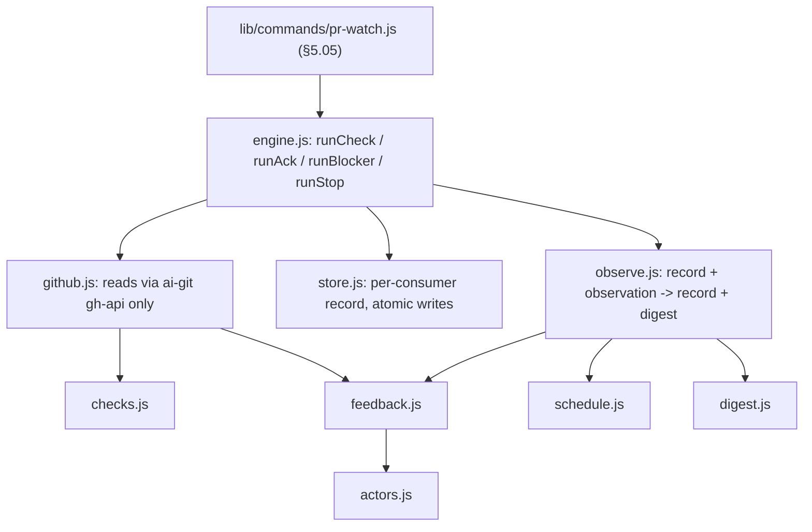

> The deterministic half of `skill/pr-stewardship`: one pass reads a PR's state
> fresh through `ai-git`, diffs it against a remembered record, and returns a
> digest — the same way no matter what woke the session.

## Overview Diagram

`engine.js`, `github.js` and `store.js` are the only modules that touch the
outside world; the other six are pure (data in, data out).

## Motivation

A PR pass has parts that must behave identically every time — classifying CI,
remembering what was already seen, deciding who may trigger a change, when to check
next, when to stop — and parts that need judgment. Prose procedures get skipped or
drifted from; code does not. So the first group lives here and the skill says "run
the helper and obey its digest", leaving only judgment (fixing a failure,
evaluating a permitted request, what to say) to the agent. Wake-independence is
structural: a cloud notification, a poll tick and a manual run all call the same
`runCheck`, which takes no event payload and re-fetches everything itself, so the
wake mechanism is the only thing that varies.

It is a CLI over pure modules rather than an MCP server. ADR 0004 defaults shared
deterministic cross-harness tooling to MCP; ADR 0005 kept `ai-git` a CLI because it
holds credentials and an open-ended surface. The helper holds no credentials — it
reaches GitHub only by spawning `ai-git gh-api` — and an `aif` subcommand needs no
install or registration step beyond the `aif` already on every session's PATH.
The pure core can sit behind an MCP wrapper later at low cost. The nine `key_files`
form one pipeline with no finer boundary a reader would use, so the split trigger
was weighed and not applied.

## Contained Building Blocks

| Block         | Responsibility                                                                                                                                                                                                                                                | Interface                                                                       |
| ------------- | ------------------------------------------------------------------------------------------------------------------------------------------------------------------------------------------------------------------------------------------------------------- | ------------------------------------------------------------------------------- |
| `actors.js`   | The one permitted-actor rule: PR author, caller-supplied human, or (non-bot) `OWNER`/`MEMBER`/`COLLABORATOR` by API `author_association`; everyone else escalates. Reads structured metadata only, never text.                                                | `classifyActor()`, `isBot()`, `PERMITTED_ASSOCIATIONS`                          |
| `checks.js`   | Classifies check-runs and legacy statuses into green/pending/red per check and overall; an unknown conclusion is red, an empty list is `none`; flags a red check already red on the base branch.                                                              | `classifyCheckRun()`, `classifyStatus()`, `evaluateChecks()`                    |
| `feedback.js` | Reduces reviews and comments to metadata (no body), then splits unhandled ones into `act` (permitted) and `escalate`; an edit re-surfaces an item; the agent's own items are recorded as handled.                                                             | `normalizeFeedback()`, `triageFeedback()`                                       |
| `schedule.js` | Stop conditions (merged, closed, landed, explicit, blocker reported, 48 quiet hours) and the cadence (pending backoff to a ceiling, a pending cap reported once, human-wait backoff), as data.                                                                | `evaluateStop()`, `planNext()`, `CADENCE`                                       |
| `digest.js`   | Derives a status and mergeable state from an observation and renders the one-line summary.                                                                                                                                                                    | `deriveStatus()`, `deriveMergeable()`, `summarize()`                            |
| `observe.js`  | The pure core: record and observation in, next record and digest out (transitions only; a permitted request stays listed until acknowledged; an escalated one is reported once). Never mutates its input.                                                     | `newRecord()`, `observe()`, `acknowledge()`                                     |
| `github.js`   | Reads PR, check, status and feedback endpoints, or a branch and its comparison with the base, only through `ai-git gh-api`; refuses any non-repository path; reads every page up to a cap. `AIF_PR_WATCH_AI_GIT_SCRIPT` points tests at a fake `ai-git`.      | `makeGhApi()`, `runAiGit()`, `fetchPrObservation()`, `fetchBranchObservation()` |
| `store.js`    | One JSON record per consumer and target under the OS temp directory, written atomically; holds logins, IDs and SHAs only, never a token or comment text. The consumer id (default: a hash of the working directory) keeps two sessions from sharing a record. | `statePath()`, `readRecord()`, `writeRecord()`, `defaultConsumer()`             |
| `engine.js`   | One pass: load the record (applying the caller's `--human`/`--self`), fetch fresh, `observe`, persist (or drop the record on stop), return the digest; plus `ack`, `blocker` and `stop`.                                                                      | `runCheck()`, `runAck()`, `runBlocker()`, `runStop()`                           |

## Consumers

`lib/commands/pr-watch.js` (§5.05), wired into `bin/aif.js` as `aif pr-watch`, is
the only caller. `skills/pr-stewardship/SKILL.md` tells agents to run it; the
skill cites it and does not restate the actor rule, cadence numbers, stop
conditions or record shape, which this block owns.
