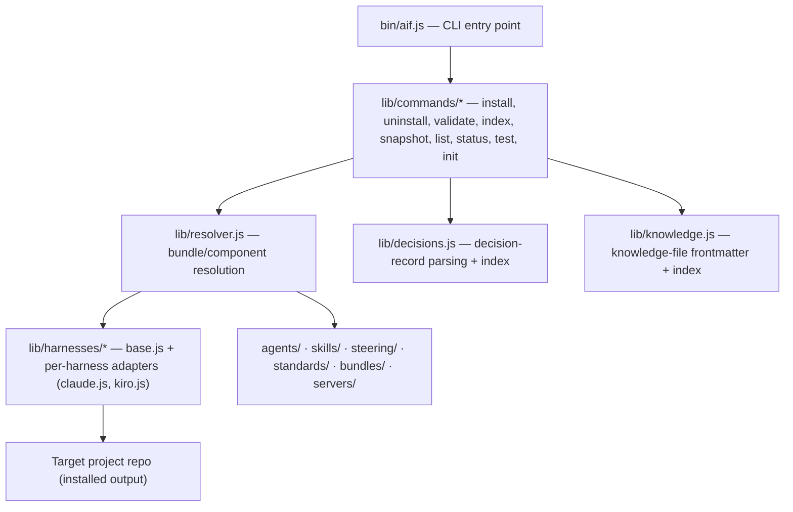

> Top-level decomposition (C4 Level 2) of the `aif` CLI and the component
> directories it operates on.

## Overview

## Building blocks

| Block | Responsibility |
|---|---|
| `bin/aif.js` | CLI entry point — parses argv, dispatches to the matching `lib/commands/*` module. |
| `lib/commands/` | One module per CLI command (`install`, `uninstall`, `validate`, `index`, `snapshot`, `list`, `status`, `test`, `init`). `index.js` also holds the knowledge/decisions path-resolution helpers (`resolveKnowledgePath`, `resolveDecisionsPath`). |
| `lib/resolver.js` | Resolves which components (agents/skills/steering/standards) a bundle pulls in, given a project's `.aiconfig.json` and chosen bundle. |
| `lib/harnesses/` | `base.js` defines the shared adapter contract; `claude.js` and `kiro.js` transform resolved components into each harness's native format. Adding a harness means adding one adapter here, not touching component sources. |
| `lib/decisions.js` | Parses decision-record frontmatter, builds the `docs/decisions/index.json` index, inverts `supersedes` into `superseded_by`. |
| `lib/knowledge.js` | Parses/validates knowledge-file frontmatter and builds knowledge/architecture index entries. |
| `lib/project-init.js` | Backs the `init` command — scaffolds a new project from `projects/_template/`. |
| `agents/` | Agent definitions (`.yaml`): role, prompt, tool grants, skill list. See `agents/README.md`. |
| `skills/` | Reusable procedures agents invoke (`SKILL.md` + optional `reference/`). |
| `steering/` | Always-on rules, global and per-domain. |
| `standards/` | Prescriptive coding/stack rules, tag-matched per project. |
| `bundles/` | Per-harness install bundles (which components a given install pulls in). |
| `servers/` | MCP tool server definitions (`dag`, `gmail`, `youtrack`) a project can install alongside agents. |

## White-box expansions

Individual blocks get their own `05.NN_*.md` subsection once there's enough
implementation detail to warrant one (arc42's white-box expansion pattern) — created
lazily, same as every other section here, not pre-scaffolded. None exist yet.
