> Level-1 whitebox of the `aif` CLI and the component directories it resolves,
> transforms, and installs — decomposed into black boxes, each with its
> responsibility and interface.

## Overview

```mermaid
graph TD
  subgraph Entry["Entry points"]
    CLI["bin/aif.js"]
    GitCLI["bin/ai-git.js"]
  end

  subgraph Commands["Command layer — lib/commands/*"]
    Install["install.js"]
    Uninstall["uninstall.js"]
    Status["status.js"]
    List["list.js"]
    Validate["validate.js"]
    Test["test.js"]
    Snapshot["snapshot.js"]
    Index["index.js"]
    Init["init.js"]
  end

  subgraph Core["Core libraries — lib/*.js"]
    Resolver["resolver.js"]
    Manifest["manifest.js"]
    SnapLib["snapshot/io.js + pure.js"]
    Decisions["decisions.js"]
    Architecture["architecture.js"]
    IndexDiff["index-diff.js"]
    ProjInit["project-init.js"]
    AiGitLib["ai-git.js"]
    Const["constants.js / component-defs.js"]
  end

  subgraph Harnesses["Harness adapters — lib/harnesses/*"]
    Base["base.js — createAdapter()"]
    Claude["claude.js"]
    Kiro["kiro.js"]
  end

  subgraph Sources["Component sources — declarative"]
    Agents["agents/"]
    Skills["skills/"]
    Steering["steering/"]
    Standards["standards/"]
    Bundles["bundles/"]
    Template["projects/_template/"]
  end

  CLI --> Install & Uninstall & Status & List & Validate & Test & Snapshot & Index & Init
  GitCLI --> AiGitLib

  Install --> Resolver
  Install --> Claude
  Install --> Kiro
  Install --> Manifest
  Uninstall --> Manifest
  Uninstall --> Claude
  Uninstall --> Kiro
  Status --> Manifest
  Status --> SnapLib
  Snapshot --> SnapLib
  Index --> Decisions
  Index --> Architecture
  Decisions --> IndexDiff
  Architecture --> IndexDiff
  Init --> ProjInit
  ProjInit --> Template

  Claude --> Base
  Kiro --> Base

  Resolver --> Agents
  Resolver --> Skills
  Resolver --> Steering
  Resolver --> Bundles
```

MCP servers (`servers/dag`, `servers/gmail`, `servers/youtrack`) aren't shown as
graph nodes here — `resolver.js` only reads their `*.yaml` definitions to resolve
which get installed; the actual MCP connection is a harness-runtime relationship
(harness ↔ server process/endpoint), not a static code dependency. See the MCP
servers table below and §3 Technical context.

## Motivation for this decomposition

The six groups below split along the one boundary that actually matters for this
system: **what has to change together when a harness is added, vs. what never
should.** Entry points and the command layer are harness-agnostic orchestration;
core libraries are harness-agnostic logic reused by every command; harness adapters
are the _only_ place harness-specific knowledge is allowed to live (§1 Quality
Goals' portability goal, enforced structurally); MCP servers and component sources
are content the other five groups resolve and install, not code that runs as part
of `aif` itself. Grouping any other way (e.g. by CLI command, or by file size) would
cut across that boundary and hide it.

## Building blocks

### Entry points

| Block           | Responsibility                                                          | Interface                                     |
| --------------- | ----------------------------------------------------------------------- | --------------------------------------------- |
| `bin/aif.js`    | Parses argv, dispatches to the matching `lib/commands/*` handler.       | `run(parsed)`, `parseArgs(argv)`              |
| `bin/ai-git.js` | Transparent git/gh wrapper injecting AI author identity and token auth. | CLI passthrough: `ai-git <command> [args...]` |

### Command layer (`lib/commands/*`)

| Block          | Responsibility                                                                                                                     | Interface                                                                           |
| -------------- | ---------------------------------------------------------------------------------------------------------------------------------- | ----------------------------------------------------------------------------------- |
| `install.js`   | Resolves a bundle via `resolver.js`, writes its components through the target harness adapter, records the result in the manifest. | `runInstall(parsed, repoRoot)`                                                      |
| `uninstall.js` | Removes previously-installed files using the manifest's recorded file list; per-harness settings cleanup (e.g. MCP entries).       | `runUninstall(parsed, repoRoot)`                                                    |
| `status.js`    | Reports what's installed vs. current source state (staleness) for a project.                                                       | `runStatus(parsed, repoRoot)`                                                       |
| `list.js`      | Lists available bundles/agents/skills/standards/servers in this repo.                                                              | `runList(parsed, repoRoot)`                                                         |
| `validate.js`  | Schema, cross-reference, and bundle-resolution integrity checks (`aif validate`).                                                  | `runValidate(parsed, repoRoot)`                                                     |
| `test.js`      | Thin wrapper invoking this repo's own `node:test` suite.                                                                           | `runTest(parsed, repoRoot)`                                                         |
| `snapshot.js`  | Builds/reads per-bundle, per-server, and per-hook source-hash snapshots.                                                           | `runSnapshot(parsed, repoRoot)`                                                     |
| `index.js`     | Generates the decisions and architecture indexes (`aif index decisions\|architecture`).                                            | `runIndex(parsed, repoRoot)`, `resolveDecisionsPath()`, `resolveArchitecturePath()` |
| `init.js`      | Scaffolds a new project from `projects/_template/`, interactively or via flags.                                                    | `runInit(parsed, repoRoot)`, `promptForConfig()`                                    |

### Core libraries (`lib/*.js`) — see §5.03

| Block           | Responsibility                                                                                                                                                                 | Interface                                                                             |
| --------------- | ------------------------------------------------------------------------------------------------------------------------------------------------------------------------------ | ------------------------------------------------------------------------------------- |
| `resolver.js`   | Resolves a bundle's full component set: domain auto-discovery + explicit lists + dedupe. See §5.01.                                                                            | `resolveBundle()`, `listStandards/Bundles/Servers/HookResources()`, `parseSkillRef()` |
| Everything else | `manifest.js`, `snapshot/io.js`+`pure.js`, `decisions.js`, `architecture.js`, `index-diff.js`, `project-init.js`, `ai-git.js`, `constants.js`/`component-defs.js` — see §5.03. | See §5.03.                                                                            |

### Harness adapters (`lib/harnesses/*`) — see §5.02

| Block       | Responsibility                                                                                                                         | Interface                                                                                 |
| ----------- | -------------------------------------------------------------------------------------------------------------------------------------- | ----------------------------------------------------------------------------------------- |
| `base.js`   | Shared install orchestration every adapter reuses: read source → transform → write → return a manifest-ready record. Adapter-agnostic. | `createAdapter(config)`, `parseFrontmatter()`, `resolvePreloadSkills()`, `collectFiles()` |
| `claude.js` | Claude Code adapter: agent/steering transforms, native-tool-cluster `TOOL_MAP`, shared block-command hook install.                     | `transformAgent()`, `transformSteering()`, `TOOL_MAP`, `TARGETS`                          |
| `kiro.js`   | Kiro adapter: same `createAdapter` contract, Kiro's own JSON agent format and steering inclusion rules.                                | `transformAgent()`, `transformSteering()`, `TOOL_MAP`, `TARGETS`                          |

### MCP servers (`servers/*`)

| Block      | Responsibility                                                                                                                                      | Interface                                                                                     |
| ---------- | --------------------------------------------------------------------------------------------------------------------------------------------------- | --------------------------------------------------------------------------------------------- |
| `dag`      | Local Node MCP server (stdio): validates a `tasks.json` dependency graph and computes execution waves.                                              | Tools: `dag-validate`, `dag-compute-waves` (`servers/dag/index.js`, pure logic in `logic.js`) |
| `gmail`    | Local Node MCP server (stdio): Gmail read/write operations via an OAuth2-authorized client built once at startup.                                   | Tools per `gmail.yaml`; `getAuthorizedClient()` (`servers/gmail/auth.js`)                     |
| `youtrack` | Vendor-hosted — JetBrains' own remote MCP endpoint over HTTPS, bearer-token auth. No local server code at all, just a declarative `*.yaml` pointer. | Tools per `youtrack.yaml`, captured from a live `listTools()` call against the real server    |

### Component sources (declarative — resolved by `resolver.js`, transformed by a harness adapter)

| Block                 | Responsibility                                                                                  | Interface                                                    |
| --------------------- | ----------------------------------------------------------------------------------------------- | ------------------------------------------------------------ |
| `agents/`             | Agent definitions: role, prompt, tool grants, skill list.                                       | One `{name}.yaml` per agent — see `AGENTS.md` for the schema |
| `skills/`             | Reusable procedures agents invoke by name.                                                      | `SKILL.md` + optional `reference/` per skill folder          |
| `steering/`           | Always-on rules, global plus per-domain.                                                        | `.md` files under `global/` and `{domain}/`                  |
| `standards/`          | Tag-matched coding/stack rules.                                                                 | `.md` files, tag-matched per `standards` in `.aiconfig.json` |
| `bundles/`            | Per-harness install bundle definitions (domain auto-discovery and/or explicit component lists). | `{name}/bundle.yaml`                                         |
| `projects/_template/` | Skeleton a new project is scaffolded from by `aif init`.                                        | Directory tree + a placeholder `.aiconfig.json`              |

## White-box expansions

- **§5.01 Bundle resolution** (`05_01_bundle_resolution.md`) — `resolver.js`'s
  domain-auto-discovery algorithm in full.
- **§5.02 Harness adapters** (`05_02_harness_adapters.md`) — the shared adapter
  contract and where Claude Code and Kiro actually diverge.
- **§5.03 Core libraries** (`05_03_core_libraries.md`) — the remaining
  harness-agnostic support libraries `resolver.js` isn't part of.

Other blocks above stay at this level — each is a single, thin, single-purpose
module; a further whitebox wouldn't add information a reader doesn't already have
from the table row.
