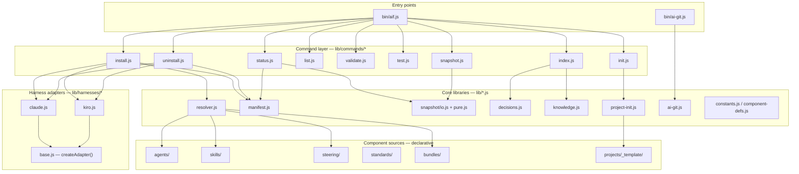

> Level-1 whitebox of the `aif` CLI and the component directories it resolves,
> transforms, and installs — decomposed into black boxes, each with its
> responsibility and interface.

## Overview

MCP servers (`servers/dag`, `servers/gmail`, `servers/youtrack`) aren't shown as
graph nodes here — `resolver.js` only reads their `*.yaml` definitions to resolve
which get installed; the actual MCP connection is a harness-runtime relationship
(harness ↔ server process/endpoint), not a static code dependency. See the MCP
servers table below and §3 Technical context.

## Building blocks

### Entry points

| Block | Responsibility | Interface |
|---|---|---|
| `bin/aif.js` | Parses argv, dispatches to the matching `lib/commands/*` handler. | `run(parsed)`, `parseArgs(argv)` |
| `bin/ai-git.js` | Transparent git/gh wrapper injecting AI author identity and token auth. | CLI passthrough: `ai-git <command> [args...]` |

### Command layer (`lib/commands/*`)

| Block | Responsibility | Interface |
|---|---|---|
| `install.js` | Resolves a bundle via `resolver.js`, writes its components through the target harness adapter, records the result in the manifest. | `runInstall(parsed, repoRoot)` |
| `uninstall.js` | Removes previously-installed files using the manifest's recorded file list; per-harness settings cleanup (e.g. MCP entries). | `runUninstall(parsed, repoRoot)` |
| `status.js` | Reports what's installed vs. current source state (staleness) for a project. | `runStatus(parsed, repoRoot)` |
| `list.js` | Lists available bundles/agents/skills/standards/servers in this repo. | `runList(parsed, repoRoot)` |
| `validate.js` | Schema, cross-reference, and bundle-resolution integrity checks (`aif validate`). | `runValidate(parsed, repoRoot)` |
| `test.js` | Thin wrapper invoking this repo's own `node:test` suite. | `runTest(parsed, repoRoot)` |
| `snapshot.js` | Builds/reads per-bundle, per-server, and per-hook source-hash snapshots. | `runSnapshot(parsed, repoRoot)` |
| `index.js` | Generates the knowledge index and the decisions index (`aif index knowledge\|decisions`). | `runIndex(parsed, repoRoot)`, `buildKnowledgeIndex()`, `resolveDecisionsPath()` |
| `init.js` | Scaffolds a new project from `projects/_template/`, interactively or via flags. | `runInit(parsed, repoRoot)`, `promptForConfig()` |

### Core libraries (`lib/*.js`)

| Block | Responsibility | Interface |
|---|---|---|
| `resolver.js` | Resolves a bundle's full component set: domain auto-discovery + explicit lists + dedupe. See §5.01. | `resolveBundle()`, `listStandards/Bundles/Servers/HookResources()`, `parseSkillRef()` |
| `manifest.js` | Tracks every file `aif install` writes, per bundle/server/hook, in `.installs.yaml` — what `uninstall` reads to know what to remove. | `readManifest()`/`writeManifest()`, `get/set/removeEntry()` |
| `snapshot/io.js` + `snapshot/pure.js` | Builds and diffs source-file-hash snapshots per bundle/server/hook to detect drift between installed output and current source. | `buildSnapshot()`, `diffSnapshot()`, `isFreshnessCurrent()` |
| `decisions.js` | Parses decision-record frontmatter, builds/diffs the decisions index, inverts `Supersedes` into `superseded_by`. | `parseDecisionRecord()`, `buildDecisionIndex()`, `diffDecisionIndex()` |
| `knowledge.js` | Validates knowledge-file frontmatter, builds index entries for `aif index knowledge`. | `validateKnowledgeFrontmatter()`, `buildIndexEntry()` |
| `project-init.js` | Validates project name/shortname, generates `.aiconfig.json` content, applies template placeholder substitution. | `buildAiConfig()`, `applyProjectConfig()` |
| `ai-git.js` | Pure logic behind the `ai-git` CLI: identity resolution, env injection, gh-command detection and auth-arg construction. | `getIdentity()`, `buildGitEnv()`, `buildGhEnv()` |
| `constants.js` / `component-defs.js` | Shared constants (canonical tool names, source directories, CLI command list) and JSDoc-only `AgentDef`/`ServerDef` type shapes — no runtime behavior, just a single owner for both. | `TOOLS`, `SOURCE_DIRS`, `COMMANDS` |

### Harness adapters (`lib/harnesses/*`) — see §5.02

| Block | Responsibility | Interface |
|---|---|---|
| `base.js` | Shared install orchestration every adapter reuses: read source → transform → write → return a manifest-ready record. Adapter-agnostic. | `createAdapter(config)`, `parseFrontmatter()`, `resolvePreloadSkills()`, `collectFiles()` |
| `claude.js` | Claude Code adapter: agent/steering transforms, native-tool-cluster `TOOL_MAP`, shared block-command hook install. | `transformAgent()`, `transformSteering()`, `TOOL_MAP`, `TARGETS` |
| `kiro.js` | Kiro adapter: same `createAdapter` contract, Kiro's own JSON agent format and steering inclusion rules. | `transformAgent()`, `transformSteering()`, `TOOL_MAP`, `TARGETS` |

### MCP servers (`servers/*`)

| Block | Responsibility | Interface |
|---|---|---|
| `dag` | Local Node MCP server (stdio): validates a `chunks.json` dependency graph and computes execution waves. | Tools: `dag-validate`, `dag-compute-waves` (`servers/dag/index.js`, pure logic in `logic.js`) |
| `gmail` | Local Node MCP server (stdio): Gmail read/write operations via an OAuth2-authorized client built once at startup. | Tools per `gmail.yaml`; `getAuthorizedClient()` (`servers/gmail/auth.js`) |
| `youtrack` | Vendor-hosted — JetBrains' own remote MCP endpoint over HTTPS, bearer-token auth. No local server code at all, just a declarative `*.yaml` pointer. | Tools per `youtrack.yaml`, captured from a live `listTools()` call against the real server |

### Component sources (declarative — resolved by `resolver.js`, transformed by a harness adapter)

| Block | Responsibility | Interface |
|---|---|---|
| `agents/` | Agent definitions: role, prompt, tool grants, skill list. | One `{name}.yaml` per agent — see `AGENTS.md` for the schema |
| `skills/` | Reusable procedures agents invoke by name. | `SKILL.md` + optional `reference/` per skill folder |
| `steering/` | Always-on rules, global plus per-domain. | `.md` files under `global/` and `{domain}/` |
| `standards/` | Tag-matched coding/stack rules. | `.md` files, tag-matched per `standards` in `.aiconfig.json` |
| `bundles/` | Per-harness install bundle definitions (domain auto-discovery and/or explicit component lists). | `{name}/bundle.yaml` |
| `projects/_template/` | Skeleton a new project is scaffolded from by `aif init`. | Directory tree + a placeholder `.aiconfig.json` (see check 13 in `docs/process-model.md`) |

## White-box expansions

- **§5.01 Bundle resolution** (`05_01_bundle_resolution.md`) — `resolver.js`'s
  domain-auto-discovery algorithm in full.
- **§5.02 Harness adapters** (`05_02_harness_adapters.md`) — the shared adapter
  contract and where Claude Code and Kiro actually diverge.

Other blocks above stay at this level — each is a single, thin, single-purpose
module; a further whitebox wouldn't add information a reader doesn't already have
from the table row.
